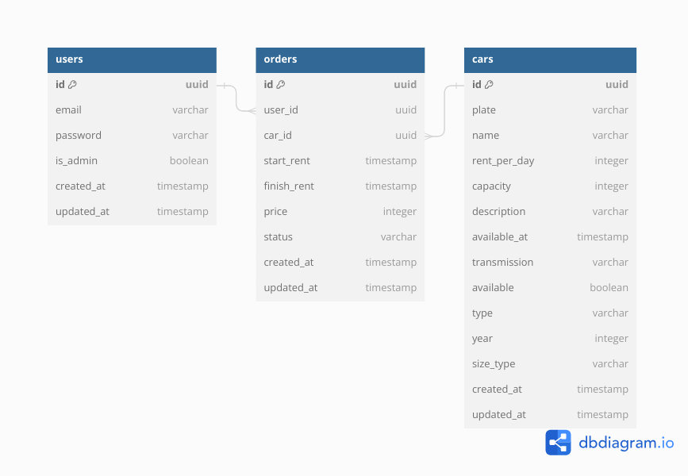

# Binar Car Management Dashboard

REST API used as the backend of Binar Car Management Dashboard.

## How to Run
- Execute command `npm i` to install required libraries
- Execute command `npm run dev` to run the server in development mode or `npm start` to build and run the server.

## Entity-Relationship Diagram

## Endpoints

### Cars
| No | URI                          | Method    | Description                              |
| -- | ----------------             | --------- | ---------------------------------------- |
| 1  | /cars                        | GET       | Retrieve cars                            |
| 2  | /cars/:id                    | GET       | Retrieve car by id                       |
| 2  | /cars/image/:filename        | GET       | Retrieve car image                       |
| 3  | /cars                        | POST      | Create car                               |
| 3  | /cars/image                  | POST      | Upload car image                         |
| 4  | /cars/:id                    | PUT       | Update car                               |
| 5  | /cars/:id                    | DELETE    | Delete car                               |

### Orders
| No | URI              | Method    | Description                              |
| -- | ---------------- | --------- | ---------------------------------------- |
| 1  | /orders          | GET       | Retrieve orders                          |

## Documentation
Documentation can be accessed [here](https://documenter.getpostman.com/view/21912047/2s9YXe8jVC)